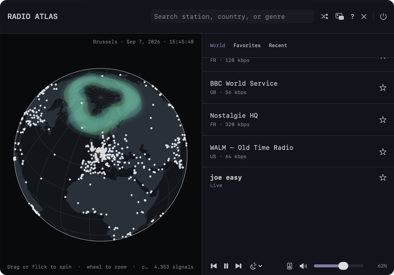

# Radio Atlas for macOS

Explore live radio on a rotatable globe, from your menu bar. Spin the world,
click a glowing signal to play that station, or click a country to browse
everything broadcasting from it. Stations come from the
[Radio Browser](https://www.radio-browser.info) directory.

Native macOS app — Swift and SwiftUI, no external dependencies.



## Credit

This project is a macOS reimplementation of
**[omarchy-radio-atlas](https://github.com/AksharP5/omarchy-radio-atlas)** by
**Akshar Patel**, which is the original of this idea and the source of its
design.

That project is a QML/Quickshell widget for the
[Omarchy](https://omarchy.org) Linux desktop. This one is an independent
rewrite in Swift, but it is a rewrite rather than an original design: the
globe's orthographic projection, the kinetic rotation physics, the colour
palette, the layout, the keyboard map, and the feature set are all taken
from it. If you are on Linux, use the original — it is the real thing, and
[available on the Omarchy plugin marketplace](https://omarchyplugins.com/plugin.html?id=akshar.radio-atlas).

Both projects are MIT licensed. The upstream copyright notice is reproduced in
full in [LICENSE](LICENSE).

## Why a macOS version

**The original cannot run on macOS.** It is built on Hyprland, Wayland and
Quickshell, plays through `mpv` with `mpv-mpris`, routes audio via PipeWire
sinks, and sandboxes its network access with `bubblewrap`. None of that exists
on macOS, so there was no porting path — only a rewrite on native equivalents:
AVFoundation for playback, CoreAudio for output devices, and
`MPRemoteCommandCenter` for Now Playing and the media keys.

**It should feel like a Mac app, not a transplant.** So it lives in the menu
bar as a `MenuBarExtra` panel with no Dock icon, offers a floating
always-on-top mini window that stays visible across Spaces, and picks audio
outputs through the system's own device list.

**And the idea was worth having here.** Rebuilding it in SwiftUI was also a
way to learn the design properly.

## Requirements

macOS 13 (Ventura) or later, on either Apple Silicon or Intel. The download is
a universal binary; nothing else is needed to run it.

## Download

Grab the latest `RadioAtlas-*-universal.zip` from
**[Releases](https://github.com/asimsan/Radio_Atlas_MacOs/releases)** — about
1.4 MB — unzip it, and drag `RadioAtlas.app` into your Applications folder.

**On first launch macOS will refuse to open it**, saying it cannot check the
app for malicious software. That is expected: the app is signed, but not
*notarized*, because notarizing requires a paid Apple Developer Program
membership. To open it:

1. Double-click the app once and dismiss the warning.
2. Open **System Settings → Privacy & Security**, scroll to **Security**, and
   click **Open Anyway** next to RadioAtlas.
3. Confirm. Every launch after that is normal.

Then look for the globe in your menu bar — the app has no Dock icon.

If you would rather not do that, build it from source instead: a locally built
app is signed on your own machine, never gets a quarantine flag, and so opens
with no warning at all.

## Build from source

Needs the [Xcode Command Line Tools](https://developer.apple.com/xcode/resources/)
(`xcode-select --install`). Takes about a minute, and needs no Apple developer
account:

```bash
git clone https://github.com/asimsan/Radio_Atlas_MacOs.git
cd Radio_Atlas_MacOs
./scripts/make-app.sh --install
```

That builds `RadioAtlas.app`, installs it to `~/Applications`, and registers it
with Launch Services. Open it from Spotlight (`⌘-Space`, type "Radio Atlas") or
from Launchpad.

To build without installing, run `./scripts/make-app.sh`; the bundle is left in
`.build/RadioAtlas.app`. Add `--universal` for a binary that runs on both
Apple Silicon and Intel, and `./scripts/make-release.sh` to produce a
distributable zip.

## Using it

Radio Atlas has **no Dock icon**. It lives in the menu bar — look for the
globe at the top right of your screen and click it to open the panel.

**The globe**

| Action | What it does |
| --- | --- |
| Drag, or flick and release | Spin the globe; a flick coasts and slows down |
| Scroll (two-finger, or wheel) | Zoom in and out |
| Pinch | Zoom in and out |
| Click a signal | Play that station |
| Click a country | Browse every station broadcasting from it |

Green and teal bands at the poles show live auroral activity, and the globe
turns itself to face whichever country is currently playing.

**The station list** sits on the right: search by station, country or genre,
star anything to keep it in Favourites, and switch between the world list,
your favourites, and recently played.

**The floating widget** — the `⏶` button in the header opens a compact
always-on-top window with the globe and player, which follows you across
Spaces and stays visible over other apps. Drag it by its header; the globe
inside still spins and zooms.

**Quitting** — the `⏻` button at the end of the header, or `⌘Q`. The `✕`
beside it only dismisses the panel.

**Keyboard**

| Key | Action |
| --- | --- |
| `/` | Search |
| `↑` `↓` | Select station |
| `⏎` | Play selected station |
| `Space` | Play or pause |
| `R` | Tune randomly |
| `F` | Favourite selected station |
| `M` | Mute or unmute |
| `+` `-` | Change volume |
| `Esc` | Back, clear, or close |
| `?` | Show or hide controls |
| `⌘Q` | Quit |

## Features

Carried over from the original: the flat-shaded orthographic globe with
kinetic rotation and deep zoom, click-to-play signals, country browsing,
country-level position estimates for stations with no coordinates, automatic
focus on the playing country, search across the directory, favourites and
listening history, random tuning that avoids recent stations, an audio output
picker, volume and mute, cached station lists with background refresh, retry
on a failed stream, and keyboard navigation.

Added here: live auroral bands driven by NOAA SWPC's OVATION model, a station's
local time and city, a sleep timer, hover tooltips, duplicate-station
collapsing, and the floating mini window.

## Missing a station?

Radio Atlas has no station list of its own — it shows whatever the community-run
[Radio Browser](https://www.radio-browser.info) directory holds. If a station
you listen to is not there, it is almost always one of two things.

**It is in the directory, but not in the world list.** The globe loads the
5,000 most-played stations, and search filters that list rather than querying
the whole directory. Anything less popular will not turn up by typing its name.
**Click its country on the globe instead** — country browsing queries Radio
Browser live and is not limited to the world list, so it will find stations the
search box cannot.

**It is not in the directory at all.** Anyone can add it, and it then works in
every Radio Browser client, not just this one:

1. Go to **[radio-browser.info/add](https://www.radio-browser.info/add)**.
2. Fill in the station's name, its stream URL, country, and any genre tags.
3. Submit it.

The same site lets you correct an entry that is already there — a dead stream
URL, a wrong country, a missing location. Fixing the country or coordinates is
what puts a station on the globe, since stations with no coordinates cannot be
drawn as a marker.

Newly added stations show up here once the cached world list refreshes, which
happens every 6 hours or whenever the app is restarted. A brand-new station
starts with no play count, so it will appear under its country long before it
is popular enough to reach the world list.

## Data and privacy

Station metadata and stream URLs come from Radio Browser and are community
supplied. Playing a station calls Radio Browser's click-count endpoint, which
is what the popularity ordering is built from. Favourites, listening history,
and the cached station lists stay on your Mac, in
`~/Library/Application Support/RadioAtlas/`.

About 38% of the directory's streams are plain `http`, so the app permits
unencrypted connections for media playback specifically — the directory API
itself is always HTTPS. Those stream connections go directly to third-party
servers and are not encrypted, so only play stations you trust.

Map geometry comes from public-domain
[Natural Earth](https://www.naturalearthdata.com) data.

## Development

```bash
swift build          # build
swift test           # 148 tests
swift run RadioAtlas # run without packaging
```

`RadioAtlasCore` holds the logic — projection, search, playback, persistence,
aurora — and is where the tests live. The `RadioAtlas` target is the SwiftUI
layer on top of it.

## Licence

MIT — see [LICENSE](LICENSE), which also carries the upstream notice from
omarchy-radio-atlas.
